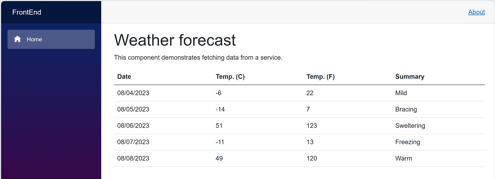
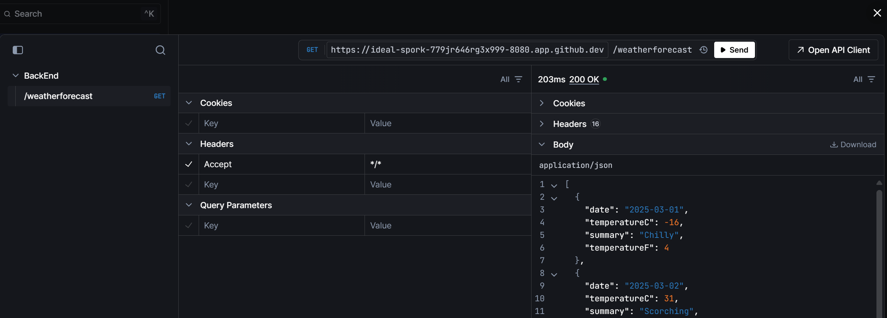

# @Cunero

readme modificado por autor.

Este Trust es implementado con la intención de prueba.

El codespace N-cleo-de-hierro es implementado como una accesible y sustentada mesa de trabajo.

### Run Options

You can also run this repository locally by following these instructions: 
1. Clone the repo to your local machine `git clone https://github.com/github/dotnet-codespaces`
1. Open repo in VS Code

## Getting started

1. ▶️ Run

3. The Blazor web app and Scalar can be open by heading to **/scalar** in your browser. On Scalar, head to the backend API and click "Test Request" to call and test the API. 

4. **🔄 Iterate quickly:** Codespaces updates the server on each save, and VS Code's debugger lets you dig into the code execution.

5. To stop running, return to VS Code, and click Stop twice in the debug toolbar. 

## Contributing

This project welcomes contributions and suggestions.  Most contributions require you to agree to a
Contributor License Agreement (CLA) declaring that you have the right to, and actually do, grant us
the rights to use your contribution. For details, visit https://cla.opensource.microsoft.com.

This project has adopted the [Microsoft Open Source Code of Conduct](https://opensource.microsoft.com/codeofconduct/).
For more information see the [Code of Conduct FAQ](https://opensource.microsoft.com/codeofconduct/faq/) or
contact [opencode@microsoft.com](mailto:opencode@microsoft.com) with any additional questions or comments.

## Trademarks

This project may contain trademarks or logos for projects, products, or services. Authorized use of Microsoft 
trademarks or logos is subject to and must follow 
[Microsoft's Trademark & Brand Guidelines](https://www.microsoft.com/en-us/legal/intellectualproperty/trademarks/usage/general).
Use of Microsoft trademarks or logos in modified versions of this project must not cause confusion or imply Microsoft sponsorship.
Any use of third-party trademarks or logos are subject to those third-party's policies.